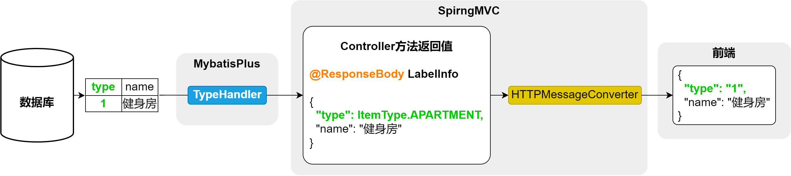

#### 7.2.2.3 标签管理

**标签管理**共有三个接口，分别是**[根据类型]查询标签列表**、**保存或更新标签信息**和**根据ID删除标签**，下面逐一实现。

首先在`LabelController`中注入`LabelInfoService`依赖，如下

```java
@Tag(name = "标签管理")
@RestController
@RequestMapping("/admin/label")
public class LabelController {

    @Autowired
    private LabelInfoService service;
}
```

##### 1. [根据类型]查询标签列表

在`LabelController`中增加如下内容

```java
@Operation(summary = "（根据类型）查询标签列表")
@GetMapping("list")
public Result<List<LabelInfo>> labelList(@RequestParam(required = false) ItemType type) {

    LambdaQueryWrapper<LabelInfo> queryWrapper = new LambdaQueryWrapper<>();
    queryWrapper.eq(type != null, LabelInfo::getType, type);
    List<LabelInfo> list = service.list(queryWrapper);
    return Result.ok(list);
}
```

**知识点**：

上述接口的功能是根据**type**（公寓/房间），查询标签列表。由于这个**type**字段在数据库、实体类、前后端交互的过程中有多种不同的形式，因此在请求和响应的过程中，**type**字段会涉及到多次类型转换。

首先明确一下**type**字段的各种形式：

- **数据库中**

  数据库中的**type**字段为`tinyint`类型

  ```
  +-------------+--------------+
  | Field       | Type         |
  +-------------+--------------+
  | id          | bigint       |
  | type        | tinyint      |
  | name        | varchar(255) |
  | create_time | timestamp    |
  | update_time | timestamp    |
  | is_deleted  | tinyint      |
  +-------------+--------------+
  ```

- **实体类**

  实体类中的**type**字段为`ItemType`枚举类型

  `LabelInfo`实体类如下

  ```java
  @Schema(description = "标签信息表")
  @TableName(value = "label_info")
  @Data
  public class LabelInfo extends BaseEntity {
  
      private static final long serialVersionUID = 1L;
  
      @Schema(description = "类型")
      @TableField(value = "type")
      private ItemType type;
  
      @Schema(description = "标签名称")
      @TableField(value = "name")
      private String name;
  }
  ```

  `ItemType`枚举类如下

  ```java
  public enum ItemType {
  
      APARTMENT(1, "公寓"),
      ROOM(2, "房间");
  
      private Integer code;
      private String name;
  
      ItemType(Integer code, String name) {
          this.code = code;
          this.name = name;
      }
  }
  ```

- **前后端交互中**

  前后端交互所传递的数据中**type**字段为**数字**（1/2）。

  

具体转换过程如下图所示：

- **请求流程**

  

  **说明**

    - SpringMVC中的`WebDataBinder`组件负责将HTTP的请求参数绑定到Controller方法的参数，并实现参数类型的转换。
    - Mybatis中的`TypeHandler`用于处理Java中的实体对象与数据库之间的数据类型转换。

- **响应流程**

  

  **说明**

    - SpringMVC中的`HTTPMessageConverter`组件负责将Controller方法的返回值（Java对象）转换为HTTP响应体中的JSON字符串，或者将请求体中的JSON字符串转换为Controller方法中的参数（Java对象），例如下一个接口**保存或更新标签信息**

  

下面介绍一下每个环节的类型转换原理

- **WebDataBinder枚举类型转换**

  `WebDataBinder`依赖于[`Converter`](https://docs.spring.io/spring-framework/reference/core/validation/convert.html)实现类型转换，若Controller方法声明的`@RequestParam`参数的类型不是`String`，`WebDataBinder`就会自动进行数据类型转换。SpringMVC提供了常用类型的转换器，例如`String`到`Integer`、`String`到`Date`，`String`到`Boolean`等等，其中也包括`String`到枚举类型，但是`String`到枚举类型的默认转换规则是根据实例名称（"APARTMENT"）转换为枚举对象实例（ItemType.APARTMENT）。若想实现`code`属性到枚举对象实例的转换，需要自定义`Converter`，代码如下，具体内容可参考[官方文档](https://docs.spring.io/spring-framework/reference/core/validation/convert.html#core-convert-Converter-API)。

    - 在**web-admin模块**自定义`com.atguigu.lease.web.admin.custom.converter.StringToItemTypeConverter`

      ```java
      @Component
      public class StringToItemTypeConverter implements Converter<String, ItemType> {
          @Override
          public ItemType convert(String code) {
      
              for (ItemType value : ItemType.values()) {
                  if (value.getCode().equals(Integer.valueOf(code))) {
                      return value;
                  }
              }
              throw new IllegalArgumentException("code非法");
          }
      }
      ```

    - 注册上述的`StringToItemTypeConverter`，在**web-admin模块**创建`com.atguigu.lease.web.admin.custom.config.WebMvcConfiguration`，内容如下：

      ```java
      @Configuration
      public class WebMvcConfiguration implements WebMvcConfigurer {
      
          @Autowired
          private StringToItemTypeConverter stringToItemTypeConverter;
      
          @Override
          public void addFormatters(FormatterRegistry registry) {
              registry.addConverter(this.stringToItemTypeConverter);
          }
      }
      ```

  但是我们有很多的枚举类型都需要考虑类型转换这个问题，按照上述思路，我们需要为每个枚举类型都定义一个Converter，并且每个Converter的转换逻辑都完全相同，针对这种情况，我们使用[`ConverterFactory`](https://docs.spring.io/spring-framework/reference/core/validation/convert.html#core-convert-ConverterFactory-SPI)接口更为合适，这个接口可以将同一个转换逻辑应用到一个接口的所有实现类，因此我们可以定义一个`BaseEnum`接口，然后另所有的枚举类都实现该接口，然后就可以自定义`ConverterFactory`，集中编写各枚举类的转换逻辑了。具体实现如下：

    - 在**model模块**定义`com.atguigu.lease.model.enums.BaseEnum`接口

      ```java
      public interface BaseEnum {
          Integer getCode();
          String getName();
      }
      ```

    - 令所有`com.atguigu.lease.model.enums`包下的枚举类都实现`BaseEnun`接口

    - 在**web-admin模块**自定义`com.atguigu.lease.web.admin.custom.converter.StringToBaseEnumConverterFactory`

      ```java
      @Component
      public class StringToBaseEnumConverterFactory implements ConverterFactory<String, BaseEnum> {
          @Override
          public <T extends BaseEnum> Converter<String, T> getConverter(Class<T> targetType) {
              return new Converter<String, T>() {
                  @Override
                  public T convert(String source) {
      
                      for (T enumConstant : targetType.getEnumConstants()) {
                          if (enumConstant.getCode().equals(Integer.valueOf(source))) {
                              return enumConstant;
                          }
                      }
                      throw new IllegalArgumentException("非法的枚举值:" + source);
                  }
              };
          }
      }
      ```

    - 注册上述的`ConverterFactory`，在**web-admin模块**创建`com.atguigu.lease.web.admin.custom.config.WebMvcConfiguration`，内容如下：

      ```java
      @Configuration
      public class WebMvcConfiguration implements WebMvcConfigurer {
      
          @Autowired
          private StringToBaseEnumConverterFactory stringToBaseEnumConverterFactory;
      
          @Override
          public void addFormatters(FormatterRegistry registry) {
              registry.addConverterFactory(this.stringToBaseEnumConverterFactory);
          }
      }
      ```

      **注意：**

      最终采用的是`ConverterFactory`方案，因此`StringToItemTypeConverter`相关代码可以直接删除。

- **TypeHandler枚举类型转换**

  Mybatis预置的`TypeHandler`可以处理常用的数据类型转换，例如`String`、`Integer`、`Date`等等，其中也包含枚举类型，但是枚举类型的默认转换规则是枚举对象实例（ItemType.APARTMENT）和实例名称（"APARTMENT"）相互映射。若想实现`code`属性到枚举对象实例的相互映射，需要自定义`TypeHandler`。

  不过MybatisPlus提供了一个[通用的处理枚举类型的TypeHandler](https://baomidou.com/pages/8390a4/)。其使用十分简单，只需在`ItemType`枚举类的`code`属性上增加一个注解`@EnumValue`，Mybatis-Plus便可完成从`ItemType`对象到`code`属性之间的相互映射，具体配置如下。

  ```java
  public enum ItemType {
  
      APARTMENT(1, "公寓"),
      ROOM(2, "房间");
  
      @EnumValue
      private Integer code;
      private String name;
  
      ItemType(Integer code, String name) {
          this.code = code;
          this.name = name;
      }
  }
  ```

- **HTTPMessageConverter枚举类型转换**

  `HttpMessageConverter`依赖于Json序列化框架（默认使用Jackson）。其对枚举类型的默认处理规则也是枚举对象实例（ItemType.APARTMENT）和实例名称（"APARTMENT"）相互映射。不过其提供了一个注解`@JsonValue`，同样只需在`ItemType`枚举类的`code`属性上增加一个注解`@JsonValue`，Jackson便可完成从`ItemType`对象到`code`属性之间的互相映射。具体配置如下，详细信息可参考Jackson[官方文档](https://fasterxml.github.io/jackson-annotations/javadoc/2.8/com/fasterxml/jackson/annotation/JsonValue.html)。

  ```java
  @Getter
  public enum ItemType {
  
      APARTMENT(1, "公寓"),
      ROOM(2, "房间");
  
      @EnumValue
    	@JsonValue
      private Integer code;
      private String name;
  
      ItemType(Integer code, String name) {
          this.code = code;
          this.name = name;
      }
  }
  ```

##### 2.保存或更新标签信息

在`LabelController`中增加如下内容

```java
@Operation(summary = "保存或更新标签信息")
@PostMapping("saveOrUpdate")
public Result saveOrUpdateFacility(@RequestBody LabelInfo labelInfo) {
    service.saveOrUpdate(labelInfo);
    return Result.ok();
}
```

##### 3. 根据ID删除标签

在`LabelController`中增加如下内容

```java
@Operation(summary = "根据id删除标签信息")
@DeleteMapping("deleteById")
public Result deleteLabelById(@RequestParam Long id) {
    service.removeById(id);
    return Result.ok();
}
```