#### 7.2.2.8 图片上传管理

由于公寓、房间等实体均包含图片信息，所以在新增或修改公寓、房间信息时，需要上传图片，因此我们需要实现一个上传图片的接口。

**1. 图片上传流程**

下图展示了新增房间或公寓时，上传图片的流程。



可以看出图片上传接口接收的是图片文件，返回的Minio对象的URL。

**2. 图片上传接口开发**

下面为该接口的具体实现

- **配置Minio Client**

    - 引入Minio Maven依赖

      在**common模块**的`pom.xml`文件增加如下内容：

      ```xml
      <dependency>
          <groupId>io.minio</groupId>
          <artifactId>minio</artifactId>
      </dependency>
      ```

    - 配置Minio相关参数

      在`application.yml`中配置Minio的`endpoint`、`accessKey`、`secretKey`、`bucketName`等参数

      ```yml
      minio:
        endpoint: http://<hostname>:<port>
        access-key: <access-key>
        secret-key: <secret-key>
        bucket-name: <bucket-name>
      ```

      **注意**：上述`<hostname>`、`<port>`等信息需根据实际情况进行修改。

    - 在**common模块**中创建`com.atguigu.lease.common.minio.MinioProperties`，内容如下

      ```java
      @ConfigurationProperties(prefix = "minio")
      @Data
      public class MinioProperties {
      
          private String endpoint;
      
          private String accessKey;
      
          private String secretKey;
          
          private String bucketName;
      }
      ```

    - 在**common模块**中创建`com.atguigu.lease.common.minio.MinioConfiguration`，内容如下

      ```java
      @Configuration
      @EnableConfigurationProperties(MinioProperties.class)
      public class MinioConfiguration {
      
          @Autowired
          private MinioProperties properties;
      
          @Bean
          public MinioClient minioClient() {
              return MinioClient.builder().endpoint(properties.getEndpoint()).credentials(properties.getAccessKey(), properties.getSecretKey()).build();
          }
      }
      ```

- **开发图片上传接口**

    - 编写Controller层逻辑

      在`FileUploadController`中增加如下内容

      ```java
      @Tag(name = "文件管理")
      @RequestMapping("/admin/file")
      @RestController
      public class FileUploadController {
      
          @Autowired
          private FileService service;
      
          @Operation(summary = "上传文件")
          @PostMapping("upload")
          public Result<String> upload(@RequestParam MultipartFile file) {
      
              String url = service.upload(file);
              return Result.ok(url);
          }
      }
      ```

      **说明：**`MultipartFile`是Spring框架中用于处理文件上传的类，它包含了上传文件的信息（如文件名、文件内容等）。

    - 编写Service层逻辑

        - 在`FileService`中增加如下内容

          ```java
          String upload(MultipartFile file);
          ```

        - 在`FileServiceImpl`中增加如下内容

          ```java
          @Autowired
          private MinioProperties properties;
          
          @Autowired
          private MinioClient client;
          
          @Override
          public String upload(MultipartFile file) {
          
              try {
                  boolean bucketExists = client.bucketExists(BucketExistsArgs.builder().bucket(properties.getBucketName()).build());
                  if (!bucketExists) {
                      client.makeBucket(MakeBucketArgs.builder().bucket(properties.getBucketName()).build());
                      client.setBucketPolicy(SetBucketPolicyArgs.builder().bucket(properties.getBucketName()).config(createBucketPolicyConfig(properties.getBucketName())).build());
                  }
          
                  String filename = new SimpleDateFormat("yyyyMMdd").format(new Date()) + "/" + UUID.randomUUID() + "-" + file.getOriginalFilename();
                  client.putObject(PutObjectArgs.builder().
                          bucket(properties.getBucketName()).
                          object(filename).
                          stream(file.getInputStream(), file.getSize(), -1).
                          contentType(file.getContentType()).build());
          
                  return String.join("/", properties.getEndpoint(), properties.getBucketName(), filename);
          
              } catch (Exception e) {
                  e.printStackTrace();
              }
              return null;
          }
          
          private String createBucketPolicyConfig(String bucketName) {
          
              return """
                      {
                        "Statement" : [ {
                          "Action" : "s3:GetObject",
                          "Effect" : "Allow",
                          "Principal" : "*",
                          "Resource" : "arn:aws:s3:::%s/*"
                        } ],
                        "Version" : "2012-10-17"
                      }
                      """.formatted(bucketName);
          }
          ```

          **注意**：

          上述`createBucketPolicyConfig`方法的作用是生成用于描述指定bucket访问权限的JSON字符串。最终生成的字符串格式如下，其表示，允许(`Allow`)所有人(`*`)获取(`s3:GetObject`)指定桶(`<bucket-name>`)的内容。

          ```json
          {
            "Statement" : [ {
              "Action" : "s3:GetObject",
              "Effect" : "Allow",
              "Principal" : "*",
              "Resource" : "arn:aws:s3:::<bucket-name>/*"
            } ],
            "Version" : "2012-10-17"
          }
          ```

          由于公寓、房间的图片为公开信息，所以将其设置为所有人可访问。

        - **异常处理**

            - **问题说明**

              上述代码只是对`MinioClient`方法抛出的各种异常进行了捕获，然后打印了异常信息，目前这种处理逻辑，无论Minio是否发生异常，前端在上传文件时，总是会受到成功的响应信息。可按照以下步骤进行操作，查看具体现象

              关闭虚拟机中的Minio服务

              ```bash
              systemctl stop minio
              ```

              启动项目，并上传文件，观察接收的响应信息

            - **问题解决思路**

              为保证前端能够接收到正常的错误提示信息，应该将Service方法的异常抛出到Controller方法中，然后在Controller方法中对异常进行捕获并处理。具体操作如下

              **Service层代码**

              ```java
              @Override
              public String upload(MultipartFile file) throws ServerException, InsufficientDataException, ErrorResponseException, IOException, NoSuchAlgorithmException, InvalidKeyException, InvalidResponseException, XmlParserException, InternalException{
              
                  boolean bucketExists = minioClient.bucketExists(
                          BucketExistsArgs.builder()
                                  .bucket(properties.getBucketName())
                                  .build());
                  if (!bucketExists) {
                      minioClient.makeBucket(
                              MakeBucketArgs.builder()
                                      .bucket(properties.getBucketName())
                                      .build());
                      minioClient.setBucketPolicy(
                              SetBucketPolicyArgs.builder()
                                      .bucket(properties.getBucketName())
                                      .config(createBucketPolicyConfig(properties.getBucketName()))
                                      .build());
                  }
                  String filename = new SimpleDateFormat("yyyyMMdd").format(new Date()) +
                          "/" + UUID.randomUUID() + "-" + file.getOriginalFilename();
                  minioClient.putObject(
                          PutObjectArgs.builder()
                                  .bucket(properties.getBucketName())
                                  .stream(file.getInputStream(), file.getSize(), -1)
                                  .object(filename)
                                  .contentType(file.getContentType())
                                  .build());
              
                  return String.join("/",properties.getEndpoint(),properties.getBucketName(),filename);
              }
              ```

              **Controller层代码**

              ```java
              public Result<String> upload(@RequestParam MultipartFile file) {
                  try {
                      String url = service.upload(file);
                      return Result.ok(url);
                  } catch (Exception e) {
                      e.printStackTrace();
                      return Result.fail();
                  }
              }
              ```

            - **全局异常处理**

              按照上述写法，所有的Controller层方法均需要增加`try-catch`逻辑，使用Spring MVC提供的**全局异常处理**功能，可以将所有处理异常的逻辑集中起来，进而统一处理所有异常，使代码更容易维护。

              具体用法如下，详细信息可参考[官方文档](https://docs.spring.io/spring-framework/reference/web/webmvc/mvc-controller/ann-exceptionhandler.html)：

              在**common模块**中创建`com.atguigu.lease.common.exception.GlobalExceptionHandler`类，内容如下

              ```java
              @ControllerAdvice
              public class GlobalExceptionHandler {
              
                  @ExceptionHandler(Exception.class)
                  @ResponseBody
                  public Result error(Exception e){
                      e.printStackTrace();
                      return Result.fail();
                  }
              }
              ```

              上述代码中的关键注解的作用如下

              `@ControllerAdvice`用于声明处理全局Controller方法异常的类

              `@ExceptionHandler`用于声明处理异常的方法，`value`属性用于声明该方法处理的异常类型

              `@ResponseBody`表示将方法的返回值作为HTTP的响应体

              **注意：**

              全局异常处理功能由SpringMVC提供，因此需要在**common模块**的`pom.xml`中引入如下依赖

              ```xml
              <!--spring-web-->
              <dependency>
                  <groupId>org.springframework.boot</groupId>
                  <artifactId>spring-boot-starter-web</artifactId>
              </dependency>
              ```

            - **修改Controller层代码**

              由于前文的`GlobalExceptionHandler`会处理所有Controller方法抛出的异常，因此Controller层就无序关注异常的处理逻辑了，因此Controller层代码可做出如下调整。

              ```java
              public Result<String> upload(@RequestParam MultipartFile file) throws ServerException, InsufficientDataException, ErrorResponseException, IOException, NoSuchAlgorithmException, InvalidKeyException, InvalidResponseException, XmlParserException, InternalException {
                  String url = service.upload(file);
                return Result.ok(url);
              }
          ```
