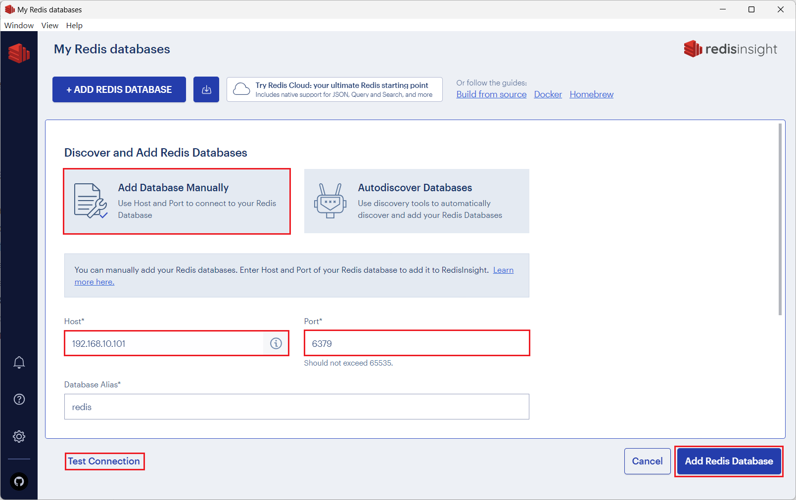
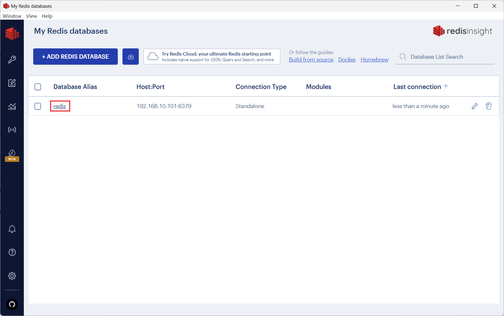

### 6.2.3 Redis快速入门

#### 6.2.3.1 Redis概述

1. **Reids定义**

   Redis（Remote Dictionary Server）是一个**基于内存**的键值对存储系统，常用作缓存服务。由于Reids将数据都保存在内存中，因此其读写性能十分惊人，同时，为保证数据的可靠性，Redis会将数据备份到硬盘上，用于故障发生时的数据恢复。

2. **Redis特点**

    - **高性能**：Redis主要将数据存储在内存中，因此读写速度非常快，适合对速度有较高要求的场景。
    - **支持多种数据结构**：Redis中键值对的值（Value）支持多种数据结构，如字符串、哈希表、列表、集合等，这使得它可以应用于多种不同的场景。
    - **持久化**：Redis可以通过**定期快照**或者**实时记录写操作日志**的方式将内存中的数据持久化到硬盘，确保数据在重启后不会丢失。
    - **灵活的数据过期策略**：可以为每个键设置过期时间，一旦过期，Redis会自动删除。

3. **Redis应用场景**

   Redis最为常见的一个应用场景就是用作**缓存**，缓存可以显著提升访问速度，降低数据库压力。

   

#### 6.2.3.2 Reids客户端

1. **命令行客户端**

   Reids提供了一个命令行客户端`redis-cli`，我们可以使用它连接到Redis服务器，然后通过命令与服务器进行各种交互，例如数据的增删改查。下面介绍该命令的基本用法。

    - **启动客户端**

      ```bash
      redis-cli -h 127.0.0.1 -p 6379
      ```

      **说明**：

        - `-h <hostname>`选项用于声明Redis服务器的主机名或IP地址，默认值为`127.0.0.1`。
        - `-p <port>`选项用于声明Redis服务器监听的端口号，默认值为`6379`。

    - **测试连接状态**

      `ping`命令可用于测试连接状态，语法如下

      ```bash
      ping
      ```

      **说明**：若连接正常，则会返回pong。

    - **退出客户端**

      `quit`命令可用于断开客户端与服务端的连接，并退出客户端，语法如下

      ```
       quit
      ```

2. **图形化客户端**

   Redis官方推荐的图形化客户端为**RedisInsight**，该客户端开源免费，且功能强大，下面演示如何使用。

    - 安装

      安装包为`RedisInsight-v2-win-installer.exe`，可在项目资料中获取，安装步骤比较简单，大家自行安装即可。

    - 选择配置数据库连接

      

    - 填写连接信息，并测试连接，通过后保存连接

      

    - 点击创建好的连接

      

    - 工作界面如下

      

#### 6.2.3.3 Redis常用数据类型及命令

##### 6.2.3.3.1 通用命令

- **查看所有键**

  `keys`命令可用于查看所有键，语法如下

  ```bash
  keys pattern
  ```

  **说明**：pattern用于匹配key，其中`*`表示任意个任意字符，`?`表示一个任意字符。

  示例：

  ```
  127.0.0.1:6379> KEYS *
  1) "k3"
  2) "k2"
  3) "k1"
  ```

  **注意**：该命令会遍历Redis服务器中保存的所有键，因此当键很多时会影响整个Redis服务的性能，线上环境需要谨慎使用。

- **键总数**

  `dbsize`可用于查看键的总数，语法如下

  ```bash
  dbsize
  ```

- **判断键是否存在**

  `exists`命令可用于判断一个键是否存在，语法如下

  ```bash
  exists key
  ```

  **说明**：若键存在则返回1，不存在则返回0。

- **删除键**

  `del`可用于删除指定键，语法如下

  ```bash
  del key [key ...]
  ```

  **说明**：返回值为删除键的个数，若删除一个不存在的键，则返回0。

- **查询键的剩余过期时间**

  ```bash
  ttl key
  ```

  **说明**：`ttl`的含义为**time to live**，用于查询一个定时键的剩余存活时间，返回值以秒为单位。若查询的键的未设置过期时间，则返回`-1`，若查询的键不存在，则返回`-2`。

- **数据库管理命令**

  Redis默认有编号为0~15的16个逻辑数据库，每个数据库之间的数据是相互独立的，所有连接默认使用的都是0号数据库。

    - **切换数据库**

      `select`命令可用于切换数据库，语法如下

      ```
      select index
      ```

      **说明**：若index超出范围，会报错

    - **清空数据库**

      `flushdb`命令会清空当前所选用的数据库，`flushall`命令会清空0~15号所有的数据库。

      **注意**：生产环境慎用

##### 6.2.3.3.2 string类型

1. **概述**

   Redis中的string类型保存的是字节序列（Sequence of bytes），因此任意类型的数据，只要经过序列化之后都可以保存到Redis的string类型中，包括文本、数字甚至是一个对象。

2. **常用命令**

    - **set**

      `set`命令用于添加string类型的键值对，具体语法如下

      ```
      SET key value [NX|XX] [EX seconds|PX milliseconds]
      ```

      各选项含义如下

        - NX：仅在key不存在时set
        - XX：仅在key存在时set
        - EX seconds：设置过期时间，单位为秒
        - PX milliseconds：设置过期时间，单位为毫秒

    - **get**

      `get`命令用于获取某个string类型的键对应的值，具体语法如下

      ```
      GET key
      ```

    - **incr**

      `incr`命令用于对数值做自增操作，具体语法如下

      ```
      INCR key
      ```

      若key对应的value是整数，则返回自增后的结果，若不是整数则报错，若key不存在则创建并返回1。

    - **decr**

      `decr`命令用于对数值做自减操作，具体语法如下

      ```
      DECR key
      ```

      若key对应的value是整数，则返回自减后的结果，若不是整数则报错，若key不存在则创建并返回-1。

3. **应用场景**

   string类型常用于缓存、计数器等场景。

##### 6.2.3.3.3 list类型

1. **概述**

   list类型可用于存储多个string类型的元素，并且所有元素按照被添加的顺序存储。

2. **常用命令**

   list类型相关的命令较多，下面分类进行进行介绍。

    - **添加元素**

      向列表中添加元素的命令有`lpush`、`rpush` 、`linsert`，各命令的功能与用法如下

      

        - `lpush`

          该命令用于向list左侧添加元素，语法如下

          ```
          lpush key element [element ...]
          ```

          示例

          ```
          lpush l1 a b c
          ```

        - `rpush`

          该命令用于向list右侧添加元素，语法如下

          ```
          rpush key element [element ...]
          ```

        - `linsert`

          该命令用于向list指定位置添加元素，语法如下

          ```
          linsert key before|after pivot element
          ```

          示例

          ```
          linsert l1 after b new
          ```

    - **查询元素**

      查询list元素的命令有`lindex`和`lrange`，各命令的功能与用法如下

        - `lindex`

          该命令用于获取指定索引位置的元素，语法如下

          ```
          lindex key index
          ```

          **说明**：index从左到右依次是0，1，2...，从右到左依次是-1，-2，-3...

        - `lrange`

          该命令用于获取指定范围内的元素列表，语法如下

          ```
          lrange key start stop
          ```

          示例

          获取list全部元素，命令如下

          ```
          lrange l1 0 -1
          ```

    - **删除元素**

      删除list元素的命令有`lpop`、`rpop`、`lrem`，各命令的功能与用法如下

      

        - `lpop`

          该命令用于移除并返回list左侧元素，语法如下

          ```
          lpop key [count]
          ```

          **说明**：count参数表示移除元素的个数

        - `rpop`

          该命令用于移除并返回list右侧的元素，语法如下

          ```
          rpop key [count]
          ```

        - `lrem`

          该命令用于移除list中的指定元素，语法如下

          ```
          lrem key count element
          ```

          **说明**：count参数表示要移除element元素的个数（list中可以存在多个相同的元素），count的用法如下

            - 若count>0，则从左到右删除最多count个element元素
            - 若count<0，则从右到左删除最多count（的绝对值）个element元素
            - 若count=0，则删除所有的element元素

    - **修改元素**

      `lset`命令可用于修改指定索引位置的元素，语法如下

      ```
      lset key index element
      ```

    - **其他**

      `llen`命令可用于查看list长度，语法如下

      ```
      llen key
      ```

3. **应用场景**

    - 社交应用中，可使用list缓存每个用户发布的最新的N条记录。
    - list可用作异步消息队列。

##### 6.2.3.3.4 set类型

1. **概述**

   和list类型相似，set类型也可用来存储多个string类型的元素，但与list类型不同，set中的元素是无序的，且set中不会包含相同元素。

2. **常用命令**

    - **集合内**

        - **sadd**

          该命令用于向set中添加元素，语法如下

          ```bash
          sadd key member [member ...]
          ```


     - **smembers**
    
       该命令用于查询set中的全部元素，语法如下
    
       ```
       smembers key
       ```


     - **srem**
    
       该命令用于移除set中的指定元素，语法如下
    
       ```
       srem key member [member ...]
       ```


     - **spop**
    
       该命令随机移除并返回set中的n个元素，语法如下
    
       ```
       spop key [count]
       ```


     - **srandmember**
    
       该命令随机返回set中的n个元素（不删除），语法如下
    
       ```
       srandmember key [count]
       ```


     - **scard**（Cardinality，基数）
    
       该命令用于查询set中的元素个数，语法如下
    
       ```
       scard key
       ```


     - **sismember**
    
       该命令用于元素是否在set中，语法如下
    
       ```
       sismember key element
       ```

- **集合间**

    - **sinter**

      该命令用于计算多个集合的交集，语法如下

      ```
      sinter key [key ...]
      ```

    - **sunion**

      该命令用于计算多个集合的并集，语法如下

      ```
      sunion key [key ...]
      ```

    - **sdiff**

      该命令用于计算多个集合的差集，语法如下

      ```
      sdiff key [key ...]
      ```

3. **应用场景**

   set可用于计算共同关注好友，随机抽奖系统等等。

##### 6.2.3.3.5 hash类型

1. **概述**

   hash类型类似于Java语言中的`HashMap`，可用于存储键值对。

   

2. **常用命令**

    - **hset**

      该命令用于向hash中增加键值对，语法如下

      ```
      hset key field value [field value ...]
      ```

    - **hget**

      该命令用于获取hash中某个键对应的值，语法如下

      ```
      hget key field
      ```

    - **hdel**

      该命令用于删除hash中的指定的键值对，语法如下

      ```
      hdel key field [field ...]
      ```

    - **hlen**

      该命令用于查询hash中的键值对个数，语法如下

      ```
      hlen key
      ```

    - **hexists**

      该命令用于判断hash中的某个键是否存在，语法如下

      ```
      hexists key field
      ```

    - **hkeys**

      该命令用于返回hash中所有的键，语法如下

      ```
      hkeys key
      ```

    - **hvals**

      该命令用于返回hash中所有的值，语法如下

      ```
      hvals key
      ```

    - **hgetall**

      该命令用于返回hash中所有的键与值，语法如下

      ```
      hgetall key
      ```

3. **应用场景**

   hash类型可用于缓存对象等。

##### 6.2.3.3.6 zset类型

1. **概述**

   zset（sorted set）被称为有序集合，同set相似，zset中也不会包含相同元素，但不同的是，zset中的元素是有序的。并且zset中的元素并非像list一样按照元素的插入顺序排序，而是按照每个元素的分数（score）排序。

   

2. **常用命令**

    - **zadd**

      该命令用于向zset中添加元素，语法如下

      ```
      ZADD key [NX|XX] score member
      ```

      **说明：**

        - NX：仅当member不存在时才add
        - XX：仅当member存在时才add

    - **zcard**

      该命令用于计算zset中的元素个数，语法如下

      ```
      zcard key
      ```

    - **zscore**

      改名用于查看某个元素的分数，语法如下

      ```
      zscore key member
      ```

    - **zrank/zrevrank**

      这组命令用于计算元素的排名，其中zrank按照score的升序排序，zrevrank则按照降序排序，语法如下

      ```
      zrank/zrevrank key member
      ```

      **说明：**名次从0开始。

    - **zrem**

      该命令用于删除元素，语法如下

      ```
      zrem key member [member ...]
      ```

    - **zincrby**

      该命令用于增加元素的分数，语法如下

      ```
      zincrby key increment member
      ```

    - **zrange**

      该命令用于查询指定区间范围的元素，语法如下

      ```
      zrange key start stop [byscore] [rev] [limit offset count] [withscores]
      ```

      **说明：**

        - start/stop：用于指定查询区间，但是在不同模式下，其代表的含义也不相同
            - 默认模式下，`start~stop`表示的是名次区间，且该区间为闭区间。名次从0开始，且可为负数，-1表示倒数第一，-2表示倒数第二，以此类推。
            - byscore模式下（声明了byscore参数），则`start~stop`表示的就是分数区间，该区间默认仍为闭区间。在该模式下，可以在`start`或`stop`前增加`(`来表示开区间，例如`(1 (5`，表示的就是`(1,5)`这个开区间。除此之外，还可以使用`-inf`和`+inf`表示负无穷和正无穷。
        - byscore：用于切换到分数模式
        - rev：表示降序排序。在byscore模式下使用rev参数需要注意查询区间，start应大于stop。
        - limit：该选项只用于byscore模式，作用和sql语句中的limit一致
        - withscores：用于打印分数

3. **应用场景**

   zset主要用于各种排行榜。

#### 6.2.3.4 SpringBoot整合Redis

##### 6.2.3.4.1 Spring Data Redis概述

**Spring Data Redis** 是Spring大家族中的一个子项目，主要用于Spring程序和Redis的交互。它基于的Redis Java客户端（[Jedis](https://github.com/redis/jedis)和[Lettuce](https://lettuce.io/)）做了抽象，提供了一个统一的编程模型，使得Spring程序与Redis的交互变得十分简单。

**Spring Data Redis** 中有一个十分重要的类——`RedisTemplate`，它封装了与Redis进行的交互的各种方法，我们主要用使用它与Redis进行交互。

##### 6.2.3.4.2 Spring Data Redis快速入门

1. **创建SpringBoot项目**

2. **引入Maven依赖**

   Spring Boot提供了对Spring Data Redis的支持，在Spring Boot项目中可以直接引入`spring-boot-starter-data-redis`来完成Spring Data Redis的自动配置，具体依赖如下

   ```xml
   <dependency>
       <groupId>org.springframework.boot</groupId>
       <artifactId>spring-boot-starter-data-redis</artifactId>
   </dependency>
   ```

3. **配置application.yml文件**

   在`application.yml`文件中增加如下参数

   ```yaml
   spring:
     data:
       redis:
         host: 192.168.10.101
         port: 6379
         database: 0
   ```

4. **RedisTemplate使用**

   由于`spring-boot-starter-data-redis`中提供了`RedisTemplate`的自动配置，所以我们可以将`RedisTemplate`注入自己的类中，如下边的案例所示

   ```java
   @SpringBootTest
   public class TestRedisTemplate {
   
       @Autowired
       private RedisTemplate redisTemplate;
   
       @Test
       public void testRedisTemplate() {
   
       }
   }
   ```

   根据Redis的数据类型，RedisTemplate对各种交互方法做了分组，以下是常用的几个分组

   | 分组                          | 说明                 |
      | :---------------------------- | :------------------- |
   | `redisTemplate.opsForValue()` | 操作string类型的方法 |
   | `redisTemplate.opsForList()`  | 操作list类型的方法   |
   | `redisTemplate.opsForSet()`   | 操作set类型的方法    |
   | `redisTemplate.opsForHash()`  | 操作hash类型的方法   |
   | `redisTemplate.opsForZSet()`  | 操作zset类型的方法   |
   | `redisTemplate`               | 通用方法             |

   下面简单测试几个简单的方法

   ```java 
   @SpringBootTest
   public class TestRedisTemplate {
   
       @Autowired
       private RedisTemplate redisTemplate;
   
       @Test
       public void testSet() {
           redisTemplate.opsForValue().set("key1", "value1");
       }
   
       @Test
       public void testGet() {
           String result = (String) redisTemplate.opsForValue().get("key1");
           System.out.println(result);
       }
   
       @Test
       public void testDel() {
           redisTemplate.delete("key1");
       }
   }
   ```

5. **序列化问题**

    - **问题演示**

        - **问题一**

          使用RedisTemplate向Redis中增加一个键值对

          ```java
          redisTemplate.opsForValue().set("key2","value2");
          ```

          使用RedisTemplate查询key2所对应的value，有结果

          ```java
          redisTemplate.opsForValue().get("key2");
          ```

          使用命令行客户端查询key2所对应的value，无结果

          ```
          get key2
          ```

        - **问题二**

          在图形化客户端或者命令行客户端观察key2，显示异常

          RedisInsight中的key2显示如下

          

          命令行客户端中的key2显示如下

          

    - **问题说明**

      上述问题的根本原因是，Redis中的key和value均是以二进制的形式存储的，因此客户端输入的key和value都会经过序列化之后才发往Redis服务端。而RedisTemplate所使用序列化方式和命令行客户端采用序列化方式不相同，进而导致序列化之后的二进制数据不同，所以才会导致上述的现象。

      

6. **StringRedisTemplate使用**

   为解决上述问题，可使用`StringRedisTemplate`代替`RedisTemplate`，因为`StringRedisTemplate`使用的序列化器和命令行所使用的序列化器是相同的。

   `spring-boot-starter-data-redis`同样提供了`StringRedisTemplate`的自动配置，因此我们也可以直接将其注入到自己的类中。实例代码如下

   ```java
   @SpringBootTest
   public class TestStringRedisTemplate {
   
       @Autowired
       private StringRedisTemplate redisTemplate;
   
       @Test
       public void testSet() {
           redisTemplate.opsForValue().set("key4", "value4");
       }
   
       @Test
       public void testGet() {
           String result = redisTemplate.opsForValue().get("key4");
           System.out.println(result);
       }
   
       @Test
       public void testDel() {
           redisTemplate.delete("key4");
       }
   }
   ```