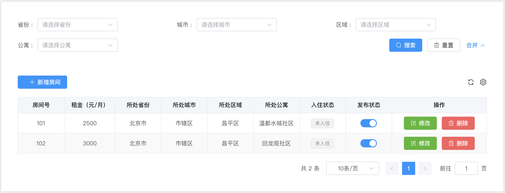

# 1. 项目概述

## 1.1 项目业务概述

尚庭公寓是一个公寓租赁平台项目，包含**移动端**和**后台管理系统**，其中移动端面向广大用户，提供找房、看房预约、租约管理等功能，后台管理系统面向管理员，提供公寓（房源）管理、租赁管理、用户管理等功能。下面分别介绍两端的具体业务功能。

### 1.1.1 移动端

移动端的线上体验地址为：http://139.198.127.41:8002，其主要业务功能如下图所示

各功能模块具体内容如下

- **房源检索**

  用户可以使用这个功能来搜索和检索符合其需求的房源。他们可以根据不同的条件，如地理位置、租金范围、支付方式等，快速找到适合的房源。

- **看房预约管理**

  用户可以通过这个功能预约看房。他们可以选择合适的时间，预约在特定的公寓进行实地看房，以便更好地了解房源的情况和环境。

- **租约管理**

  这个功能允许用户查看和管理他们的租约信息。他们可以在移动端查看租约合同，以及提交租约终止或延长的请求。

- **房源浏览历史**

  用户可以在这里查看他们曾经浏览过的房源历史记录。这个功能可以帮助用户追踪之前感兴趣的房源，方便他们重新查看或做出决策。

### 1.1.2 后台管理系统

后台管理系统的线上体验地址为：http://139.198.127.41:8001，主要业务功能如下图所示

各功能模块具体内容如下

- **公寓信息管理**

  这个模块负责管理所有公寓的基本信息，包括公寓名称、地址、联系方式等。管理员可以在这里添加、编辑、删除公寓信息。

- **房间信息管理**

  该模块负责管理每个公寓内各个房间的详细信息，包括房间号、户型、面积、租金等。管理员可以在这里进行房间信息的添加、编辑和删除。

- **公寓/房间属性管理**

  这个模块允许管理员定义公寓和房间的各种属性，比如公寓和房间的配套设施，方便管理员在维护公寓信息和房间信息时进行选择。

- **看房预约管理**

  该模块用于管理用户的看房预约请求。用户可以在移动端提交看房预约，管理员可以在后台管理系统中查看和处理这些请求，以方便安排人员接待用户。

- **租约管理**

  这个模块用于管理租约的创建、修改和终止。管理员可以在这里生成租约合同，并发送给用户签约。

- **后台系统用户管理**

  该模块用于管理后台系统的用户账户信息，管理员可以创建、编辑、删除、禁用账户信息。

- **移动端用户管理**

  这个模块负责管理移动端用户的信息。管理员可以查看用户信息，处理账户相关问题。

### 1.1.3 核心业务流程

本项目的核心业务流程为签约、续约、退租，具体流程如下图所示

在上述的业务流程中，会涉及到租约状态的多次变化，下面详细介绍一下租约状态。租约共有7个状态，分别是`签约待确认`、`已签约`、`已取消`、`已到期`、`退租待确认`、`已退租`、`续约待确认`，以下是这些状态的变化流程。

## 1.2 项目技术概述

本项目的技术架构如下图所示。

项目采用前后端分离的模式，下面介绍各模块用到的技术。

- **前端**

    - 框架：VUE3

- **后端**

    - 框架：Spring Boot

    - 数据库访问：MyBatis、MyBatis Plus

      > MyBatis-Plus（简称 MP）是一个MyBatis的增强工具，在 MyBatis 的基础上只做增强不做改变，为简化开发、提高效率而生。

    - Web：Spring MVC

- **数据存储**
    - 关系型数据库：MySQL

    - 缓存：Redis

    - 对象存储：MinIO

      > **对象存储**是用于存储非结构化数据的数据存储架构，它将一个数据单元称为一个对象，每个对象都包含数据本身、元数据（描述数据的信息）和一个唯一标识符（通常是一个URL地址）。
      >
      > 在2001年，亚马逊推出了Simple Storage Service（简称S3），这是第一个商业化的、面向互联网的对象存储服务。随后国内众多云服务厂商也都推出了自己的对象存储服务，例如阿里云的OSS，华为云的OBS，百度云的BOS等等。
      >
      > **MinIO**是一个开源的对象存储方案，兼容亚马逊S3协议。
      >
      > 对于对象存储，我们可以选择直接购买各大云厂商提供的服务，也可以选择使用开源的服务，自行安装和维护。本项目采用开源的对象存储Minio来存储图片信息。

- **部署**

    - 前端服务器：Nginx

# 2. 项目开发流程

前后端分离项目的完整开发流程如下

**第一步**

由产品经理负责分析市场、用户需求，并将其转化为详细的产品需求。然后创建初步的产品原型，以便更好地理解和传达产品的设计和功能。

> 原型通常指的是产品、系统或概念的初步版本或样品，旨在展示设计概念、功能、外观或其他关键特征。

**第二步**

由UI设计师基于产品需求和初步原型，设计用户界面的外观和交互，得到高保真的原型。高保真原型可能包含更具体的设计元素，如颜色、字体、布局等。

**第三步**

由架构师根据高保真原型，规划软件系统的整体结构和组件。他们会设计数据库架构和定义接口，输出API文档，以便开发团队进行后续工作。

> API文档是关于接口的详细说明文档，其会包含接口所提供的功能，所需参数、返回值、错误处理等细节。接口文档的目的是为开发人员、集成人员以及其他利益相关者提供清晰的指导，以便他们能够正确地使用和集成接口。
>
> 

**第四步**

前后端开发工程师根据API文档，分别开发前端和后端的业务逻辑和功能。前端工程师负责构建用户交互界面，而后端工程师负责数据处理逻辑和数据存储。

**第五步**

测试工程师进行各种测试，以确保软件的质量和稳定性。

**第六步**

运维工程师负责配置、部署和维护应用程序的生产环境，确保应用程序能够正常运行并具备良好的性能和可用性。

# 3. 项目原型

目前市面上有很多功能强大的原型设计工具，常用的有[墨刀](https://modao.cc/)，[Figma](https://www.figma.com/)等，这些工具设计出的原型美观且具备交互逻辑。以下是本项目的原型（当做原型看吧\^_\^）。

**移动端**地址：[点击访问](https://modao.cc/proto/yaPxwdkwrvtlaepAbqZzO/sharing?view_mode=device&screen=rbpTgNkz0plpyCNJi&canvasId=rcTgNntk14ENgkLr #租赁平台APP-分享)

**后台管理系统**地址：[点击访问](https://modao.cc/proto/jyri5tlrvvh6dn3SWyLBQ/sharing?view_mode=device&screen=rbpTgTi9axnREyQVW&canvasId=rcTgTi9ay8uTGyt0 #租赁平台后台管理-分享)

# 4. 数据库设计

## 4.1 数据库设计理论

### 4.1.1 数据库模型

数据库设计中最常采用的模型为**实体（Entity）关系（Relationship）模型**，简称ER模型。其核心思想是将现实世界中的复杂数据表示为一组实体，并描述这些实体之间的关系。

- **实体**通常对应现实世界中的一个**对象**，例如：学生、班级、教师、课程。

- 每个实体都包含一组**属性**，这些属性用于描述实体，例如学生实体包含姓名、年龄、性别等属性。
- **关系**用于描述各实体之间的联系，例如学生和班级之间存在从属关系。

其中**关系**可分为**一对一**、**一对多**、**多对多**三种，例如学生和班级之间的关系为**一对多**、学生和课程之间的关系为**多对多**。

实体关系模型通常使用实体关系图（ER diagram）进行表示。下图是一个简易的选课系统的实体关系图，其中方框代表实体，方框之间的连线则代表实体间的关系，连线两端的不同符号用于表示一对一、一对多、多对多的关系。

符号说明如下：

|                符号                |   说明   |
| :--------------------------------: | :------: |
|    | 表示0个  |
|  | 表示1个  |
|  | 表示多个 |

上述符号通常是两个**成对**使用，其分别表示**最小值**和**最大值**。例如上述ER图中的**班级**和**学生**之间的连线，**班级**一侧的符号表示**一**（最小值和最大值都是一），**学生**一侧的符号表示**多**（最小值是一，最大值是多），其表达的含义就是班级和学生之间的关系为**一对多**，一个学生只对应一个班级，而一个班级会对应多个学生（且至少对应一个学生）。

### 4.1.2 数据库设计流程

传统的数据库设计流程分为三个阶段，分别是概念模型设计阶段、逻辑模型设计阶段和物理模型设计阶段。三个阶段由粗略到详细，由抽象到具体。

#### 4.1.2.1 概念模型设计

概念模型是一个粗略的初步设计，其只关注实体和关系，不体现最终建表所需的各种细节信息（例如实体的属性）。下图便是一个典型的简易**选课系统**数据库的概念模型。

#### 4.1.2.2 逻辑模型设计

相较于概念模型，逻辑模型会包含更多的细节信息，例如实体的属性、用于关联两个实体的字段等等。需要注意的是，逻辑模型并不关注具体的数据库实现（例如MySQL或者Oracle）。下图是上述选课系统数据库的逻辑模型。

#### 4.1.2.3 物理模型设计

相较于逻辑模型，物理模型会包含更多的与所选数据库相关的具体信息，例如存储引擎、字段类型、索引等信息。一般而言，物理模型会包含最终建表所需的所有信息，下图是上述选课系统数据库的物理模型。

## 4.2 数据库设计实操

### 4.2.1 概念模型设计

根据原型可得，本项目包含的实体有**公寓**、**房间**、**用户(租客)**、**租约(合同)**、**看房预约**、**浏览历史**和**后台管理系统用户**，各实体间的关系如下

### 4.2.2 逻辑模型设计

根据原型明确各实体所需属性并明确各表关联字段，得到的完整的逻辑模型如下图所示。下面逐一分析。

#### 4.2.2.1 公寓信息

公寓信息包含的属性有`公寓名称`、`公寓简介`、`公寓地址`、`公寓联系方式`、`公寓图片`、`公寓标签`、`公寓杂费`、`公寓发布状态`，这部分的逻辑模型如下图所示

#### 4.2.2.2 房间信息

房间信息包含的属性有`房间号`、`房间租金`、`房间所属公寓`、`房间可选租期`、`房间可选支付方式`、`房间属性`、`房间标签`、`房间配套`、`房间图片`、`房间发布状态`，这部分的逻辑模型如下图所示

#### 4.2.2.3 用户信息

用户信息包含的属性有`手机号码`、`密码`、`头像`、`昵称`、`账号状态`，这部分的逻辑模型如下

#### 4.2.2.4 看房预约信息

看房预约包含的属性有`预约用户信息`、`预约公寓信息`、`预约时间`、`备注信息`、`预约状态`，这部分的逻辑模型如下

#### 4.2.2.5 租约信息

租约信息包含`签约用户信息`，`签约房间信息`、`租期`、`支付方式`、`租约来源`、`租金`、`押金`，这部分的逻辑模型如下

#### 4.2.2.6 浏览历史信息

浏览历史指的是用户浏览房间详情的历史，包含的属性有`用户信息`、`房间信息`、`浏览时间`，这部分的逻辑模型如下

#### 4.2.2.7 后台管理用户信息

后台管理系统用户包含的属性有，这部分的逻辑模型如下

### 4.2.3 物理模型设计

本项目采用MySQL数据库，所有表均使用InnoDB存储引擎，完整的物理模型如下图，详细信息可参考资料中的数据库初始化文件`lease.sql`。

**注意**：

- 所有表均省略了`create_time`、`update_time`、`is_deleted`三个字段。
- 所有的状态或类型字段（例如租约状态），均使用数字表示。

# 5. 接口定义

## 5.1 后台管理系统接口定义

### 5.1.1 公寓信息管理

#### 5.1.1.1 属性管理

属性管理页面包含公寓和房间各种可选的属性信息，其中包括**房间的可选支付方式**、**房间的可选租期**、**房间的配套**、**公寓的配套**等等。其所需接口如下

- **房间支付方式管理**

  **页面如下**

  

  **所需接口如下**

    - `查询全部支付方式列表`
    - `保存或更新支付方式`
    - `根据ID删除支付方式`

- **房间租期管理**

  **页面如下**

  

  **所需接口如下**

    - `查询全部租期列表`
    - `保存或更新租期`
    - `根据ID删除租期`

- **标签管理**

  **页面如下**

  

  **所需接口如下**

    - `保存或更新标签`
    - `查询标签列表`
    - `根据ID删除标签`

- **配套管理**

  **页面如下**

  

  **所需接口如下**

    - `保存或更新配套`
    - `查询配套列表`
    - `根据ID删除配套`

- **房间基本属性管理**

  **页面如下**

  

  **所需接口如下**

    - `保存或更新属性名称`
    - `保存或更新属性值`
    - `查询全部属性名称和属性值列表`
    - `根据ID删除属性名称`

    - `根据ID删除属性值`

- **公寓杂费管理**

  **页面如下**

  

  **所需接口如下**

    - `保存或更新杂费名称`
    - `保存或更新杂费值`
    - `查询全部杂费名称和杂费值列表`
    - `根据ID删除杂费名称`

    - `根据ID删除杂费值`

#### 5.1.1.2 公寓管理

- **公寓列表页面**

  **页面如下**

  

  **所需接口如下**

    - `根据条件分页查询公寓列表`

    - 查询条件所需接口
        - `查询省份列表`
        - `根据省份ID查询城市列表`
        - `根据城市ID查询区县列表`
    - `根据ID修改公寓发布状态`
    - `根据ID删除公寓信息`

- **公寓详情页面**

  **页面如下**

  

  **所需接口如下**

    - `根据ID查询公寓详细信息`（用作修改时的表单回显）
    - `保存或更新公寓信息`
    - 表单所需接口

        - `查询省份列表`
        - `根据省份ID查询城市列表`
        - `根据城市ID查询区县列表`
        - `查询公寓配套列表`
        - `查询公寓标签列表`
        - `查询公寓杂费信息列表`
        - `上传图片`

#### 5.1.1.3 房间管理

- **房间列表页面**

  **页面如下**

  

  **所需接口如下**

    - `根据条件分页查询房间列表`

    - 查询条件所需接口

        - `查询省份列表`
        - `根据省份ID查询城市列表`
        - `根据城市ID查询区县列表`
        - `根据区县ID查询公寓列表`
    - `根据ID修改房间发布状态`
    - `根据ID删除房间信息`

- **房间详情页面**

  **页面如下**

  

  **所需接口如下**

    - `根据ID查询房间详细信息`（用作修改时的表单回显）
    - `保存或更新房间信息`
    - 表单所需接口
        - `查询省份列表`
        - `根据省份ID查询城市列表`
        - `根据城市ID查询区县列表`
        - `根据区县ID查询公寓列表`
        - `查询房间属性列表`
        - `查询房间标签列表`
        - `查询全部支付方式列表`
        - `查询租期列表`
        - `上传图片`

### 5.1.2 租赁管理

#### 5.1.2.1 预约看房管理

- **看房预约列表页面**

  **页面如下**

  

  **所需接口如下**

    - `分页查询预约信息列表`

    - 查询条件所需接口

        - `查询省份列表`
        - `根据省份ID查询城市列表`
        - `根据城市ID查询区县列表`
        - `根据区县ID查询公寓列表`
    - `根据ID更新预约状态`

#### 5.1.2.2 租约管理

- **租约列表页面**

  **页面如下**

  

  **所需接口如下**

    - `根据条件分页查询租约信息列表`
    - 查询条件所需接口

        - `查询省份列表`
        - `根据省份ID查询城市列表`
        - `根据城市ID查询区县列表`
        - `根据区县ID查询公寓列表`
    - `根据ID更新租约状态`
    - `根据ID删除租约信息`

- **租约详情页面**

  **页面如下**

  

  **所需接口**

    - `根据ID查询租约信息`（用作更新租约时的表单回显）
    - `保存或修改租约信息`
    - 表单所需接口

        - `查询省份列表`
        - `根据省份ID查询城市列表`
        - `根据城市ID查询区县列表`
        - `根据区县ID查询公寓列表`
        - `根据公寓ID查询房间列表`
        - `查询可选支付方式列表`
        - `查询可选租期列表`

### 5.1.3 用户管理

#### 5.1.3.1 用户列表页面

**页面如下**

**所需接口如下**

- `分页查询用户信息列表`
- `根据用户ID更新账号状态`

### 5.1.4 系统管理

#### 5.1.4.1 系统用户岗位管理

- **岗位列表页面**

  **页面如下**

  

  **所需接口如下**

    - `分页查询岗位信息列表`
    - `根据ID修改岗位状态`
    - `根据ID删除岗位`

- **岗位详情页面**

  **页面如下**

  

  **所需接口如下**

    - `根据ID查询岗位详细信息`（用作修改时的表单回显）
    - `保存或更新岗位信息`

#### 5.1.4.2 系统用户信息管理

- **系统用户列表页面**

  **页面如下**

  

  **所需接口如下**

    - `根据条件分页查询系统用户列表`
    - `根据ID修改用户状态`
    - `根据ID删除系统用户信息`

  **所需接口如下**

- **系统用户详情页面**

  **页面如下**

  

  **所需接口如下**

    - `根据ID查询系统用户详细信息`
    - `保存或更新系统用户信息`
    - `表单所需接口`
        - 查询岗位列表

### 5.1.5 登录管理

#### 5.1.5.1 登录页面

**页面如下**

**所需接口如下**

- `获取图形验证码`
- `请求登录`
- `获取登录用户信息`

## 5.2 移动端接口定义

### 5.2.1 登录

#### 5.2.1.1 登录页面

页面如下

所需接口如下

- `获取短信验证码`
- `请求登录`
- `获取登录用户基本信息`

### 5.2.2 找房

#### 5.2.2.1 房间列表页面

页面如下

所需接口如下

- `根据查询条件分页查询房间列表`
- 查询条件所需接口

    - `查询省份列表`
    - `根据省份ID查询城市信息`
    - `根据城市ID查询区县信息`
    - `查询支付方式列表`

#### 5.2.2.2 房间详情页面

页面如下

所需接口如下

- `根据ID查询房间详细信息`

#### 5.2.2.3 公寓详情页面

页面如下

所需接口如下

- `根据ID查询公寓详细信息`
- `根据公寓ID查询房间列表`

### 5.2.3 个人中心

#### 5.2.3.1 浏览历史

页面如下

所需接口如下

- `查询登录用户的浏览历史列表`

#### 5.2.3.2 看房预约

- **看房预约列表页面**

  页面如下

  

  所需接口如下

    - `查询登录用户的看房预约列表`

- **看房预约详情页面**

  页面如下

  

  所需接口如下

    - `根据ID查询看房预约详细信息`
    - `保存或更新看房间预约信息`

#### 5.2.3.3 租约管理

- **租约列表页面**

  页面如下

  

  

  所需接口如下

    - `查询登录用户的租约列表`
    - `根据ID修改租约状态`

- **租约详情页面**

  页面如下

  

  所需接口如下

    - `根据ID查询租约详细信息`
    - `保存或修改租约信息`
    - 表单所需接口
        - `根据房间ID查询可选支付方式列表`
        - `根据房间ID查询可选租期列表`

### 5.2.4 我的房间

略

### 5.2.5 圈子

略

### 5.2.6 消息通知

略
